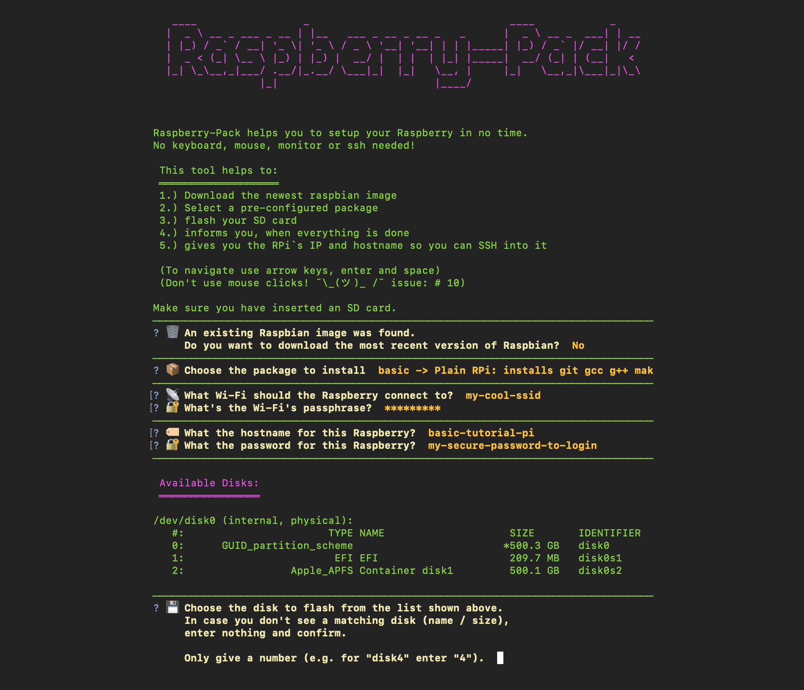

|                                                  | Raspberry-Pack                                                                                                                                                                                                                        |
| ------------------------------------------------ | ------------------------------------------------------------------------------------------------------------------------------------------------------------------------------------------------------------------------------------- |
|  | **Why Raspberry-Pack:** Don't flash each Raspberry Pi by hand, but automate things and make it reusable, and all that headlessly: No keyboard, no mouse, no monitor, no ssh needed.<br><br> **Headless, easy, fast and reproducible** |



# How to use Raspberry-Pack

- Raspberry-Pack is designed for use with [Raspberry Pi](http://www.raspberrypi.org) version 1-4

## The step by step wizard guides you through the installation process

- download raspbian image
- select package
- flash to SD
- boot your RPi
- informs you when the install is done
- helps how to connect to it via ssh (not required)

## Getting started

```
# install Raspberry-Pack tool
pip install -r requirements.txt

# run Raspberry-Pack wizard
python wizard.py
```

- **Raspberry-Pack relies on [Python 3](https://docs.python-guide.org/starting/install3/osx/), try using `pip3` and `python3` when encountering issues**
- **MAC/OSX supported only (No Windows or Linux support)**

## Create your own Raspberry-Pack

Create a folder inside `packages/`. Each package name has the prefix `raspberry-pack-`.

| Filename                   | required | use                                                                                                     |
| -------------------------- | -------- | ------------------------------------------------------------------------------------------------------- |
| `readme.md`                | ✔        | documentation & description for that package                                                            |
| `wpa_supplicant.conf`      |          | contains WiFi details to connect                                                                        |
| `📦/apt-get-packages.conf` |          | space-seperated list of packages to install via `sudo apt-get install`                                  |
| `📦/hostname.conf`         |          | defines hostname                                                                                        |
| `📦/user-password.conf`    |          | defines user's (`pi`) password                                                                          |
| `📦/autologin.conf`        |          | when this file exists, the system will login automatically (CLI/GUI)                                    |
| `📦/no-update.conf`        |          | when this file exists, the system will not update system packages (only use during development)         |
| `📦/update-only.conf`      |          | when this file exists, the system will only update system packages                                      |
| `📦/run-before-boot.sh`    |          | script to run when the SD flashing is done. Executed on your Mac, e.g. to alter the config.txt on SD    |
| `📦/run-on-boot.sh`        |          | script to run after updating and installing apt packages                                                |
| `📦/run-after-boot.sh`     |          | script to run after the "installation done"-signal. Useful, when connection will drop                   |
| `📦/*`                     |          | add all your files you need for your script in here. In your script you can access it here `/boot/📦/*` |

> 📦 = `raspberry-pack`
>
> If you don't need a certain \*.conf file, better delete it, than leaving it empty. Keep things tidy.
>
> Take care your script doesn't need user interaction, use piping and other tricks to achieve required inputs

# Development

## Ressources

- [`raspi-config` commandline options](https://github.com/RPi-Distro/raspi-config/blob/master/raspi-config)
- [Updating and Upgrading RPi](https://www.raspberrypi.org/documentation/raspbian/updating.md)
- [Configuration options Rpi](https://www.raspberrypi.org/documentation/configuration/)
- [Older images of raspbian](https://downloads.raspberrypi.org/raspbian/images/)

## Feature backlog

- choose between Lite/Desktop version of Raspbian (right now its Lite only)
- handle empty files in a better way
- make username adjustable via `user-name.conf`
- ask if all security relevant infos should be removed from the raspberry-pack (or zipped and encrypted)
- specify version of raspbian image to store the precise state
- replace bash scripts with python scripts
- make linux compatible
- make windows compatible
- allow packages to ask questions as well in an easy way (e.g. AP will ask for `ssid` and `wpa-passphrase`)
- put all features into sub-packages (MQTT broker, AP, Apache in a separate folder under raspberry-pack) to make package creation easier
- create packages based on sub-packages (user can tick features he wants to have e.g. AP + NodeRed)
- Add automatically the installers ssh key
- run ansible script when system is setup
- enable vnc (`sudo raspi-config nonint do_vnc %d`)

## Future packages / sub-packages

- Docker on Pi
- Samba (currently requires user-interaction, that can't be easily by-passed)
- Presentation-Pi (Videos/Photo slides)

## Our logo

- Our logo is a remix of the trademark's logo of [Raspberry Pi](http://www.raspberrypi.org)
- Raspberry-Pack is no official product of Raspberry Pi
- Next to our license also check their [Trademark Rules](https://www.raspberrypi.org/trademark-rules/)

## Your contribution

- You are welcome to submit merge requests for packages you created and consider useful for a broader audience
- Found a bug, report it as an issue
- If you port it for windows / linux, we are more than happy to provide it to everyone 🤗
